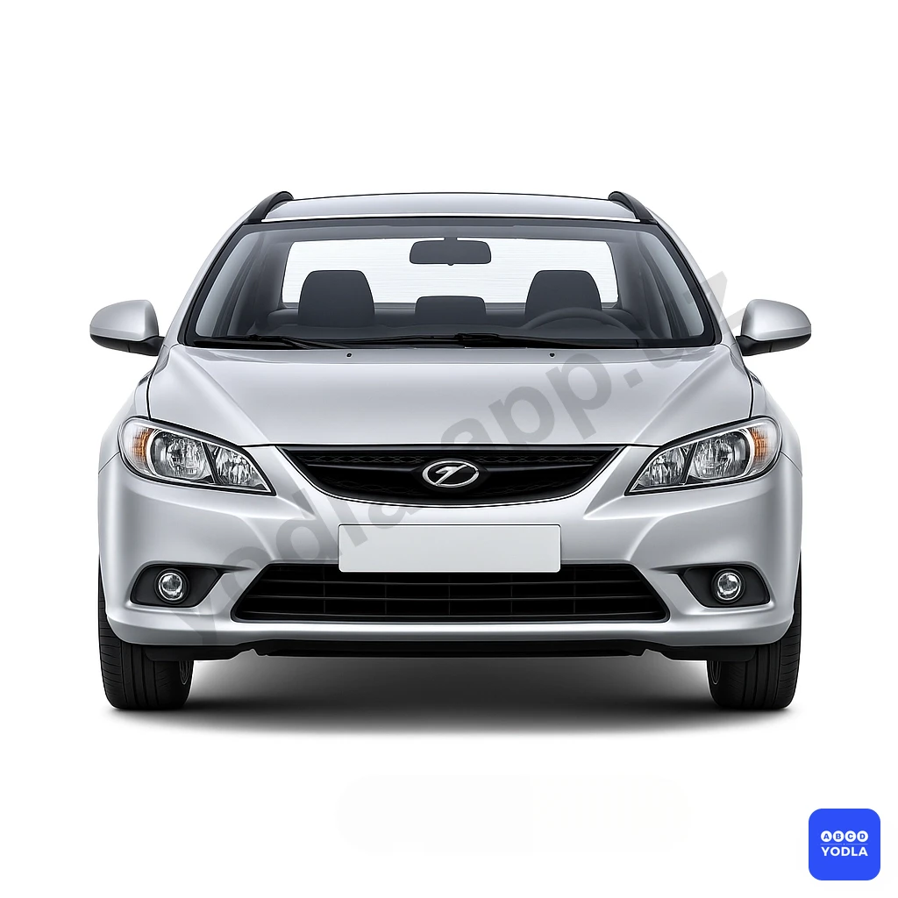

# 40. Условия, запрещающие эксплуатацию транспортных средств (боб 3)

Всего вопросов: 46

## Вопрос 1

**Эксплуатация каких транспортных средств запрещена, если у них отсутствуют аптечка и огнетушитель?**

⬜ A. Только категории транспортных средств « М1 »
⬜ B. Только категории транспортных средств « М2, М3, N1 »
⬜ C. Только категории транспортных средств « N2, N3 »
✅ D. Все указанные категории транспортных средств

> 💡 В соответствии с пунктом 7.10 Приложения 3 ПДД: Эксплуатация транспортных средств запрещается, если они не оборудованы следующим: 
категории М2, М3 — молоток для разбивания стекол в чрезвычайной ситуации, медицинская аптечка, огнетушитель (2 шт. один огнетушитель должен находиться в кабине водителя, второй в пассажирском салоне), знак аварийной остановки (или мигающий красный фонарь), и световозвращающий жилет; 
микроавтобусах, автотранспортных средствах категорий М1, N1, N2, N3 и на колесных тракторах медицинская аптечка, огнетушитель, знак аварийной остановки (или мигающий красный фонарь) и световозвращающий жилет;
категорий М3, N2, N3, — противооткатные упоры (не менее двух) соответствующие диаметру колес автотранспортного средства; 
категории О, тракторах, гужевых повозках и других самоходных машинах внешние световозвращатели; на мотоцикле с боковым прицепом медицинская аптечка, знак аварийной остановки.

---

## Вопрос 2

**При каких условиях запрещается эксплуатация транспортных средств?**

⬜ A. Не действует рабочая тормозная система
⬜ B. Подтекает жидкость из системы гидравлических тормозов
⬜ C. Компрессор не обеспечивает установленного давления в системе пневматических тормозов
✅ D. При всех указанных условиях

> 💡 В соответствии с пунктами 1.3 и 1.4 раздела 1 приложения 3 к ПДД, использование транспортных средств запрещается: 
Нарушена герметичность гидравлического тормозного привода;
Нарушение герметичности пневматического тормозного привода вызывает падение давления воздуха при неработающем компрессоре более чем на 0,05 МПа (0,5 кг/кв. см) за 30 мин. при свободном положении органов управления тормозной системой или за 15 мин. при включенных органах управления. 
В соответствии с третьим абзацем пункта 12 главы 2 ПДД: управлять транспортным средством, если на транспортном средстве не работает тормозная система, рулевое управление, стеклоочиститель во время дождя или снегопада, неисправно сцепное устройство (в составе автопоезда), не горят или отсутствуют фары и задние габаритные огни в темное время суток или в условиях ограниченной видимости.
Соответственно, при всех указанных условиях эксплуатация транспортных средств запрещена.

---

## Вопрос 3

**Какой должна быть минимальная остаточная высота рисунка протектора шин транспортных средств категорий M2 и M3?**

⬜ A. 0,8 мм.
⬜ B. 1,2 мм.
⬜ C. 1,6 мм.
✅ D. 2 мм.
⬜ E. 2,5 мм.

> 💡 Шины имеют остаточную высоту рисунка протектора для автотранспортных средств категории N2, N3, O3, O4 менее 1,0 мм; для M1, N1, O1, O2 менее 1,6 мм, для автотранспортных средств категорий М2, МЗ, менее 2,0 мм, для мотоциклов, электромотоциклов, мопедов и скутеров - если она ме��ьше 0,8 мм.
Примечание: для прицепа устанавливаются нормы остаточной высоты рисунка протектора шин, аналогичные нормам для шин автомобилей-тягачей.

---

## Вопрос 4

**В каком из перечисленных случаев разрешается эксплуатация автотранспортных средств?**

⬜ A. Между сдвоенными шинами имеются инородные предметы
⬜ B. Шины по размеру или допустимой нагрузки не соответствуют модели транспортного средства
✅ C. На передней оси автотранспортных средств категории М1; М2;М3 класса 1 установлены шины по первому классу ремонта
⬜ D. Во всех случаях разрешается

> 💡 Согласно пункту 5.7 Раздела 5 Приложения 3 ПДД: На передней оси автотранспортных средств категорий М1, М2, М3 класса I, средней и задней осях автотранспортных средств категории М3 классов II и III установлены шины, восстановленные по второму классу ремонта.

---

## Вопрос 5

**При каких перечисленных условиях запрещается эксплуатация транспортных средств?**

⬜ A. Не работает манометр пневматического привода тормозов
⬜ B. Неисправен рулевой демпфер мотоцикла
⬜ C. Суммарный люфт рулевого управления категории транспорного средства М1 более 10 градусов
✅ D. Во всех перечисленных случаях

> 💡 Согласно приложению 3 ПДД, запрещается эксплуатация транспортных средств в следующих случаях: Согласно пункту 1.5 раздела 1: Не работает манометр пневматического или пневмогидравлического тормозного привода. Согласно пунктам 2.1 и 2.3 раздела 2 Приложения 3 ПДД: Суммарный люфт в рулевом управлении в регламентированных условиях испытаний автотранспортного средства не должен превышать следующих значений: M1 – 10 градусов M2, M3, N1 - 20 градусов N2, N3 -25 градусов. Неисправен или отсутствует предусмотренный конструкцией усилитель рулевого управления или рулевой демпфер на мотоциклах.

---

## Вопрос 6

**Какой наибольший суммарный люфт допускается правилами для категории автотранспортных средств N2; N3?**

⬜ A. 16°
⬜ B. 20°
✅ C. 25°
⬜ D. 26°
⬜ E. 30°

> 💡 Согласно пункту 2.1 приложения № 3 к ПДД, суммарный люфт в рулевом управлении в регламентированных условиях испытаний автотранспортного средства категории N3 не должен превышать 25 градусов.

---

## Вопрос 7

**Какое количество противотуманных фар разрешается устанавливать на легковом автомобиле?**

✅ A. Две
⬜ B. Четыре
⬜ C. По усмотрению водителя

> 💡 Согласно пункту 3.1 раздела 3 приложения 3 ПДД: Количество, тип, расположение и режим работы внешних световых приборов не соответствуют требованиям конструкции транспортного средства. На легковых автомобилях, снятых с производства, допускается установка внешних световых приборов от автомобилей других марок и моделей.
Примечание: Мотоциклы, мопеды могут быть оборудованы одной противотуманной фарой, другие транспортные средства — двумя.

---

## Вопрос 8

**Разрешается ли устанавливать на одну ось автомобиля шины с различным рисунком протектора?**

⬜ A. Разрешается только на переднюю ось
⬜ B. Разрешается на автомобиль с передним ведущим мостом только на заднюю ось
✅ C. Запрещается

> 💡 Согласно пункту 5.5 приложения № 3 к ПДД, запрещается эксплуатация транспортных средств, если на одну ось транспортных средств установлены шины различных размеров, конструкций (радиальной, диагональной, камерной, бескамерной), с различными рисунками протектора, морозостойких и неморозостойких, новые и восстановленные, новые и с углубленным рисунком протектора.

---

## Вопрос 9

**На уклоне ниже насколько система стояночного тормоза не может удерживать транспортные средства М в неподвижном состоянии?**

⬜ A. 18 %
⬜ B. 20 %
⬜ C. 24 %
✅ D. 25 %

> 💡 В соответствии с примечанием к приложению 1 Правил дорожного движения, дорожные знаки 1.8, 1.15, 1.16, 1.31, 1.17, 1.18.1 — 1.18.3, 1.21, 1.30, 2.6, 2.7, 3.1, 3.2, 3.11 — 3.16, 3.18.1 — 3.18.25 могут устанавливаться в качестве временных дорожных знаков. Временные дорожные знаки будут желтого цвета.

---

## Вопрос 10

**При каких из перечисленных условий запрещается эксплуатация транспортного средства?**

⬜ A. Не работают в установленном режиме стеклоочистители
⬜ B. Неисправна система выпуска отработанных газов
⬜ C. Отсутствует предусмотренный конструкцией задний противооткатный буфер безопасности
✅ D. При всех перечисленных условиях

> 💡 Согласно пункту 4.1 раздела 4 приложения 3 ПДД «Условия при которых запрещается эксплуатация транспортных средств»: если стеклоочиститель не работает в установленном порядке, в соответствии с пунктом 6.3 раздела 6: если неисправна система отвода выхлопных газов, а также в соответствии с пунктом 7.7 раздела 7: если в конструкции транспортного средства не предусмотрены задние защитные устройства, брызговики и грязезащитные щитки, использование транспортных средств запрещается.
Соответственно, при всех перечисленных условиях запрещается эксплуатация транспортных средств.

---

## Вопрос 11

**Шины транспортных средств категории М1 должны иметь остаточную высоту рисунка протектора не менее:**

⬜ A. 0,8 мм
⬜ B. 1,0 мм
✅ C. 1,6 мм
⬜ D. 2,0 мм
⬜ E. 2,5 мм

> 💡 Согласно пункту 5.1 приложения № 3 к ПДД, запрещается эксплуатация транспортных средств, если шины имеют остаточную высоту рисунка протектора для автотранспортных средств категорий N2, N3, О3, О4 менее 1,0 мм; для автотранспортных средств категорий М1, N1, О1, О2 менее 1,6 мм; для автотранспортных средств категорий М2, М3 менее 2,0 мм; для мотоциклов и мопедов (скутеров, квадроциклов) менее 0,8 мм.

---

## Вопрос 12

**При каких условиях разрешается эксплуатация транспортных средств?**

⬜ A. Шины имеют местные повреждения; обнажающие корд
⬜ B. На передней оси легкового автомобиля категории М1 установлены шины; восстановленные по второму классу ремонта
✅ C. Остаточная высота рисунка протектора шин грузовых автомобилей 1,6 мм

> 💡 Согласно пункту 5.1 раздела 5 приложения 3 ПДД «Условия при которых запрещается эксплуатация транспортных средств»: если высота остаточного рисунка протектора шин для автотранспортных средств категорий N2, N3, O3, O4 составляет менее 1,0 мм, использование транспортных средств запрещено. 
Соответственно, если остаточная высота протектора шин для транспортных средств категории N2 и N3 составляет 1,6 мм, эксплуатация такого транспортного средства разрешена.

---

## Вопрос 13

**Шины мотоциклов должны иметь остаточную высоту рисунка протектора не менее:**

⬜ A. 0,5 мм
✅ B. 0,8 мм
⬜ C. 1,0 мм
⬜ D. 1,6 мм
⬜ E. 2,0 мм

> 💡 Согласно пункту 5.1 приложения № 3 к ПДД, запрещается эксплуатация транспортных средств, если шины имеют остаточную высоту рисунка протектора для автотранспортных средств категорий N2, N3, О3, О4 менее 1,0 мм; для автотранспортных средств категорий М1, N1, О1, О2 менее 1,6 мм; для автотранспортных средств категорий М2, М3 менее 2,0 мм; для мотоциклов и мопедов (скутеров, квадрациклов) менее 0,8 мм.

---

## Вопрос 14

**Разрешается ли эксплуатация транспортных средств; у которых между сдвоенными шинами имеются инородные предметы?**

✅ A. Запрещается
⬜ B. Разрешается только по правой полосе дороги при наличии двух и более полос для движения в данном направлении
⬜ C. Разрешается при движении со скоростью не более 40 км/ч

> 💡 Согласно пункту 5.3 приложения № 3 к ПДД, запрещается эксплуатация транспортных средств, если  между сдвоенными шинами имеются инородные предметы, представляющие опасность.

---

## Вопрос 15

**В случае обнаружения негерметичности топливной системы водитель должен:**

⬜ A. Прекратите дальнейшие действия
✅ B. Принять меры к устранению неисправности, а если это невозможно, следовать к месту стоянки или ремонта с соблюдением необходимых мер предосторожности
⬜ C. Продолжить намеченную поездку

> 💡 Согласно пункту 6.2 шестого раздела приложения №3 ПДД: эксплуатация транспортных средств запрещена, если: Нарушена герметичность системы питания. Согласно одиннадцатому абзацу пункта 12 главы 2 ПДД: При возникновении в пути условий, при которых запрещается эксплуатация транспортных средств, указанных в приложении 3 к Правилам, водитель должен устранить их, а если это невозможно, он может следовать к месту стоянки или ремонта использованием эвакуатора или методом буксировки.

---

## Вопрос 16

**В каком из нижеперечисленных случаях можно использовать транспортное средство?**

⬜ A. Направление фары искажены
✅ B. На автомобилях; которые были сняты с производства; были установлены внешние фонари автомобили различных типов и моделей
⬜ C. Внешние фары и отражатели не работают должным образом или загрязнены

> 💡 Пункту 3.1. приложения № 3 к ПДД, Количество, тип, расположение и режим работы внешних световых приборов не соответствуют требованиям конструкции транспортного средства. На легковых автомобилях, снятых с производства, допускается установка внешних световых приборов от автомобилей других марок и моделей.

---

## Вопрос 17

**Разрешается ли эксплуатация автомобиля; если отсутствует предусмотренные конструкцией транспортного средства зеркала заднего вида?**

⬜ A. Разрешается; если заднее стекло не закрыто шторками
✅ B. Запрещается
⬜ C. Разрешается; если имеется хотя бы одно зеркало

> 💡 В “Условиях, при которых запрещается эксплуатация транспортных средств” (приложение №3 к ПДД) сказано, что эксплуатация транспортных средств запрещена, если: 7.1. Отсутствуют предусмотренные конструкцией транспортного средства зеркала заднего вида.

---

## Вопрос 18

**Минимально допускаемое Правилами значение остаточной высоты рисунка протектора шин автотранспортных средств категории N2; N3; 03; 04 составляет:**

⬜ A. 0,5 мм
✅ B. 1 мм
⬜ C. 1,6 мм
⬜ D. 2 мм
⬜ E. 3 мм

> 💡 Согласно пункту 5.1 приложения № 3 к ПДД, запрещается эксплуатация транспортных средств, если шины имеют остаточную высоту рисунка протектора для автотранспортных средств категорий N2, N3, О3, О4 менее 1,0 мм; для автотранспортных средств категорий М1, N1, О1, О2 менее 1,6 мм; для автотранспортных средств категорий М2, М3 менее 2,0 мм; для мотоциклов и мопедов (скутеров, квадроциклов) менее 0,8 мм.

---

## Вопрос 19

**Разрешается ли следовать к месту стоянки или ремонта с недействующим рулевым управлением?**

⬜ A. Разрешается при буксировке на жесткой сцепке
⬜ B. Разрешается со скоростью обеспечивающей безопасность движения
✅ C. Запрещается

> 💡 Абзацу 3 пункта 12 главы 2 ПДД, водителю запрещается: управлять транспортным средством, если на транспортном средстве не работает тормозная система, рулевое управление, стеклоочиститель со стороны водителя во время дождя или снегопада, неисправно сцепное устройство (в составе автопоезда), не горят или отсутствуют фары и задние габаритные огни в темное время суток или в условиях недостаточной видимости.

---

## Вопрос 20

**Если эффективность торможения рабочей тормозной системы транспортных средств не отвечает требованиям Правил, то Вы должны:**

⬜ A. Продолжить намеченную поездку, при этом в светлое время суток включить ближний свет фар
⬜ B. Прекратить дальнейшее движение
✅ C. Устранить неисправность на месте, а если это невозможно. следовать к месту стоянки или ремонта с соблюдением необходимых мер предосторожности

> 💡 Пункта 91 главы 13 ПДД, гласит: Остановка запрещается в следующих местах: на пешеходных переходах и менее чем за 10 метров до них.

---

## Вопрос 21

**Тормозная система считается неисправной, если нарушена герметичность пневматического привода, что вызывает падение давления воздуха при неработающем компрессоре за 30 мин, при свободном положении органов управления в МПа, более чем:**

⬜ A. 0,025
⬜ B. 0,035
✅ C. 0,05
⬜ D. 0,055
⬜ E. 0,06

> 💡 Согласно пункту 1.4 приложения № 3 к ПДД, запрещается эксплуатация транспортных средств, если нарушение герметичности пневматического или пневмогидравлического тормозного привода вызывает падение давления воздуха при неработающем двигателе более чем на 0,05 МПа за 30 мин. при свободном положении органов управления тормозной системой или за 15 мин. при включенных органах управления.

---

## Вопрос 22

**При каких условиях запрещается эксплуатация транспортных средств?**

⬜ A. Нарушена регулировка фар
⬜ B. Загрязнены внешние световые приборы и светоотражатели
⬜ C. На световых приборах используются лампы не соответствующие типы данного светового прибора
✅ D. При всех перечисленных условиях

> 💡 Пунктам 3.2 - 3.4 раздела 3 приложения № 3 к ПДД: Условия, при которых запрещается эксплуатация транспортных средств: нарушена регулировка фар; не работают в установленном режиме или загрязнены внешние световые приборы и световозвращатели; на световых приборах отсутствуют рассеиватели либо используются рассеиватели и лампы, не соответствующие типу данного светового прибора.

---

## Вопрос 23

**При каких условиях запрещается эксплуатация механических транспортных средств?**

⬜ A. Перебои в работе двигателя
⬜ B. Шум в коробке передач
✅ C. Не прошедших государственный периодический технический осмотр в установленном порядке

> 💡 Абзацу 3 пункта 179 главы 29 ПДД, запрещается эксплуатация транспортных средств в следующих случаях: транспортных средств, не прошедших государственный технический осмотр.

---

## Вопрос 24

**Высота рисунка протектора шин автомобилей категорий М2, М3 не должна быть менее:**

⬜ A. 0,8 мм
⬜ B. 1,0 мм
⬜ C. 1,6 мм
✅ D. 2,0 мм
⬜ E. 2,5 мм

> 💡 Согласно пункту 5.1 приложения № 3 к ПДД, запрещается эксплуатация транспортных средств, если шины имеют остаточную высоту рисунка протектора для автотранспортных средств категорий N2, N3, О3, О4 менее 1,0 мм; для автотранспортных средств категорий М1, N1, О1, О2 менее 1,6 мм; для автотранспортных средств категорий М2, М3 менее 2,0 мм; для мотоциклов и мопедов (скутеров, квадрациклов) менее 0,8 мм.

---

## Вопрос 25

**В каком из перечисленных случаев разрешается эксплуатация транспортных средств?**

⬜ A. Шины по размеру и допустимой нагрузке не соответствуют модели транспортного средства
⬜ B. На одну ось транспортного средства установлены диагональные шины совместно с радиальными
✅ C. На переднюю ось легкового автомобиля категории М1 установлены шины, восстановленные по первому классу ремонта

> 💡 Пункту 5.7 раздела 5 приложения Nº 3 к ПДД, условия при которых запрешается эксплуатация автотранспортных средств: на передней оси автотранспортных средств категории M1, М2, МЗ класса 1 установлены шины, востановленные по второму классу ремонта.

---

## Вопрос 26

**Разрешается ли установка шин с различным рисунком протектора на одну ось транспортного средства?**

⬜ A. Разрешается только на заднюю ось автомобиля с передним ведущим мостом
✅ B. Запрещается
⬜ C. Разрешается только на грузовой автомобиль
⬜ D. Разрешается

---

## Вопрос 27

**Разрешается ли установка шин; восстановленных по второму классу ремонта на легковых автомобилях?**

⬜ A. Запрещается
⬜ B. Разрешается на обоих осях автомобиля
✅ C. Разрешается только на задней оси

> 💡 В "Условиях, при которых запрещается эксплуатация транспортных средств" (приложение №3 к ПДД) сказано, что эксплуатация транспортных средств запрещена, если: 5.7. На передней оси легкового автомобиля и автобуса (кроме междугородного) установлены шины, восстановленные по второму классу ремонта. Как видно, запрещается на передней оси легкового автомобиля устанавливать шины, восстановленные по второму классу ремонта. Соответственно, на задней оси разрешается.

---

## Вопрос 28

**В каких случаях разрешается пользоваться транспортным средством?**

⬜ A. Если на внешней поверхности транспортного средства нанесены различные изображения, которые не соответствуют законодательству и негативно влияют на безопасность передвижения
✅ B. При соответствии технических показателей (параметров), указанных на внешней стороне газовых баллонов автобуса и автомобиля, оборудованных системой газоснабжения, данным (показателям) в техническом паспорте, дата последнего и планового осмотров
⬜ C. При окраске кузова (кабины) в несколько разных цветов в случаях, не предусмотренных заводом-изготовителем (кроме спецавтомобилей)

> 💡 Пункту 7.19 раздела 7 приложения № 3 к ПДД, технические параметры, указанные на наружной поверхности газовых баллонов автомобилей и автобусов, оснащенных газовой системой питания, не соответствуют данным технического паспорта, отсутствуют даты последнего и планируемого освидетельствования.

---

## Вопрос 29

**Разрешается ли эксплуатация транспортных средств с неопломбированным спидометровым оборудованием?**

⬜ A. Разрешается
⬜ B. Запрещается
✅ C. Разрешается только автомобилей, мотоциклов и мопедов, принадлежащих индивидуальным владельцам

> 💡 В “Условиях, при которых запрещается эксплуатация транспортных средств” (приложение №3 к ПДД) сказано, что эксплуатация транспортных средств запрещена, если: 7.6. Неисправно и не опломбировано спидометровое оборудование (исключая транспортные средства, принадлежащие индивидуальным владельцам, мотоциклы, электромотоциклов, скутеров и мопедов).

---

## Вопрос 30

**В каком случае Правила запрещают дальнейшее движение транспортных средств?**

⬜ A. Имеются значительные внешние повреждения деталей кузова (кабины) и окраски
✅ B. Неисправно сцепное устройство (в составе автопоезда)
⬜ C. Разрушен коренной лист или центральный болт рессоры

> 💡 Согласно абзацу 3 пункта 12 главы 2 ПДД, водителю запрещается управлять транспортным средством, если на транспортном средстве неисправен сцепное устройство (в составе автопоезда).

---

## Вопрос 31

**В каком случае  разрешается эксплуатация транспортного средства?**

⬜ A. Загрязнены внешние световые приборы
⬜ B. Нарушена регулировка фар
✅ C. Спереди - установлены белые или желтые противотуманные фары

> 💡 Согласно знаку 3.2 раздела 3 приложения № 1 к ПДД, «Движение запрещено», запрещается движение всех транспортных средств и согласно знаку 3.3 раздела 3 приложения № 1 к ПДД, «Движение механических транспортных средств запрещено», запрещается движение транспортных средств (кроме мопеда), приводимое в движение двигателем, а также любых тракторов и самоходных механизмов. Действие знаков не распространяется на транспортные средства, которые обслуживают предприятия, находящиеся в обозначенной зоне, а также обслуживают или принадлежат гражданам, проживающим или работающим в обозначенной зоне.

---

## Вопрос 32

**Суммарный люфт в рулевом управлении в регламентированных условиях испытаний автотранспортного средства категория М3 не должен превышать следующих значений:**

⬜ A. 10°
✅ B. 20°
⬜ C. 25°

> 💡 Согласно раздела 1 приложения № 2 к ПДД, горизонтальная разметка 1.5 — разделяет транспортные потоки противоположных направлений на дорогах, имеющих две или три полосы; обозначает границы полос движения при наличии двух и более полос, предназначенных для движения в одном направлении. Линию 1.5 пересекать разрешается с любой стороны.

---

## Вопрос 33

**В каком случае запрещается эксплуатация транспортного средства?**

⬜ A. Не работает указатель уровня топлива
⬜ B. Нарушена система  зажигания
⬜ C. Затруднен пуск двигателя
✅ D. Не работает звуковой сигнал

> 💡 Согласно пункту 7.2 Приложение № 3 к Правилам дорожного движения, запрещается эксплуатация транспортных,  если не работает звуковой сигнал.

---

## Вопрос 34

**Вы имеете право эксплуатировать легковой автомобиль при отсутствии?**

⬜ A. Аптечки
⬜ B. Огнетушителя
⬜ C. Знака аварийной остановки
✅ D. Противооткатных упоров

> 💡 Согласно пункту 46 главы 8 ПДД, подача сигнала указателями поворотов (левого поворота) должна прекращаться немедленно после его завершения. Подаваемый сигнал не должен вводить в заблуждение других участников дорожного движения.

---

## Вопрос 35

**Каковы типичные признаки наступившего утомления водителя?**

✅ A. Сонливость, вялость, снижение внимания
⬜ B. Zo'riqish, asabiylashish
⬜ C. Головокружение, ощущение песка в глазах, потливость

> 💡 Знак 5.7.1 раздела 5 приложения № 1 к ПДД, «Выезд на дорогу с односторонним движением». Выезд на дорогу или проезжую часть с односторонним движением. Запрещают поворот налево.
Знак 5.10.2 раздела 5 приложения № 1 к ПДД, «Выезд на дорогу с полосой для маршрутных транспортных средств». Запрещает поворот налево.

---

## Вопрос 36

**Какие из перечисленных транспортных средств разрешается эксплуатировать без огнетушителя?**

⬜ A. Автомобили
⬜ B. Автобусы
✅ C. Все мотоциклы
⬜ D. Только мотоциклы без бокового прицепа.

> 💡 Знак 4.6 раздела 4 приложения № 1 к ПДД, «Пешеходная дорожка».

---

## Вопрос 37

**Разрешается ли устанавливать шторки или жалюзи на заднем стекле легкового автомобиля?**

⬜ A. Запрещается
✅ B. Разрешается, но только при наличии с обеих сторон зеркал заднего вида

> 💡 Время реакции водителя, зависящее от многих факторов, обычно составляет от 0,4 до 1,6 секунды. Исходя из этого среднее время реакции водителя принимается равным 1 секунде. Поэтому при выборе безопасной дистанции для движения со скоростью около 90 км/час водителю важно помнить, что за 1 секунду транспортное средство перемещается на расстояние примерно 25 м. (что равнозначно 90 000 метров/час или 90 000 метров : 3 600 секунд = примерно 25 метров за 1 секунду).

---

## Вопрос 38

**На каком уклоне запрещается эксплуатация автотранспортных средств категории N в загруженном состоянии, полной нагрузкой при необеспечении неподвижного состояния стояночной тормозной системы?**

⬜ A. Менее 25 процентов.
⬜ B. Менее 16 процентов.
✅ C. Менее 31 процентов.
⬜ D. Менее 20 процентов.

> 💡 При кратковременной остановке на подъеме, на автомобиле с механической трансмиссией следует привести в действие стояночный тормоз.

---

## Вопрос 39

**Какой максимально допустимый люфт в рулевом управления автомобилей категории М3:**

⬜ A. 10 градусов
✅ B. 20 градусов
⬜ C. 25 градусов

> 💡 Согласно требованиям безопасности дорожного движения, среднее время реакции водителя принято равным около 1 секунды.

---

## Вопрос 40

**Какая максимально допустимая величина люфта в рулевом управления транспортных средств категории М2:**

⬜ A. 10 градусов
✅ B. 20 градусов
⬜ C. 3,25 градусов

> 💡 Очень важным моментом при движении в ночное время является выбор скорости движения. При этом следует учитывать главное условие - расстояние видимости водителем дороги должно превышать величину остановочного пути.

---

## Вопрос 41

**Суммарный люфт в рулевом управлении в регламентированных условях испытаний автотранспортного средства категория N1 не должен превышать следующих значений:**

⬜ A. 10 градусов
✅ B. 20 градусов
⬜ C. 25 градусов

> 💡 Согласно статьи 6 Правил дорожного движения, разделительная полоса — элемент дороги, разделяющий смежные проезжие части и не предназначенный для движения и остановки транспортных средств, приподнята над уровнем дороги или отделена газоном, канавой, специальными ограждениями.

---

## Вопрос 42

**Автотранспортное средство категории М:**

✅ A. Механические автотранспортные средства, имеющие не менее четырех колес и используемые для перевозки пассажиров
⬜ B. Автотранспортные средства, предназначенные для перевозки грузов, максимальная масса которых не превышает 3,5 т
⬜ C. F3. Прицепы (включая полуприцепы)

> 💡 Ниже указаны пункты ПДД: 5.10.2, 5.10.3. “Выезд на дорогу с полосой для маршрутных транспортных средств”. 5.11.1. “Место для разворота”. Поворот налево запрещается.

---

## Вопрос 43

**Разрешается эксплуатация грузовых автомобилей с разрешенной максимальной массой не более 3,5 тн. при отсутствии:**

⬜ A. Огнетушителя
⬜ B. Аптечки
✅ C. Противооткатного устройства соответствующего диаметру колеса (минимум 2)
⬜ D. Знака аварийной остановки.

> 💡 Согласно пункту 3 статьи 16 Правил дорожного движения, группы детей разрешается водить только по тротуарам и пешеходным дорожкам, а при их отсутствии — по обочинам, только в светлое время суток и в сопровождении взрослых.

---

## Вопрос 44

**Правила для легковых автомобилей, выпущенных до 01.01.1981 г. какой норматив эффективности работы тормозной системы допускается при движении со скоростью 40км/с при торможении?**

⬜ A. 7,2 m
⬜ B. 12,2 m
⬜ C. 19,5 m
⬜ D. 25 m
✅ E. 14,5 m

> 💡 ПДД приложение № 1: 2.5. Движение без остановки запрещено.
Запрещается движение без остановки перед стоп-линией, а если ее нет — перед краем пересекаемой проезжей части. Водитель должен уступить дорогу транспортным средствам, движущимся по пересекаемой, а при наличии дополнительного дорожного знака 7.13 — по главной дороге.
Этот дорожный знак может быть установлен перед железнодорожным переездом или карантинным постом. В этих случаях водитель должен остановиться перед стоп-линией, а при ее отсутствии — перед знаком.

---

## Вопрос 45

**Данное транспортное средство к какой категории относится?**

✅ A. M1
⬜ B. M2
⬜ C. N1
⬜ D. O1

> 💡 ПДД приложение № 1: 3.18.2. Поворот налево запрещен.

---

## Вопрос 46

**Как называется этот предупреждающий знак?**

⬜ A. Окисляющие вещества
✅ B. Органические пероксиды
⬜ C. Легковоспламеняющиеся газы и жидкости

> 💡 Пункта 119 главы 18 ПДД гласит:
В случаях, когда движение через переезд запрещено, водитель должен остановиться у стоп-линии, дорожного знака 2.5 или светофора, если их нет — не ближе 5 м от шлагбаума, а при отсутствии шлагбаума — не ближе 10 м до ближайшего рельса.

---

