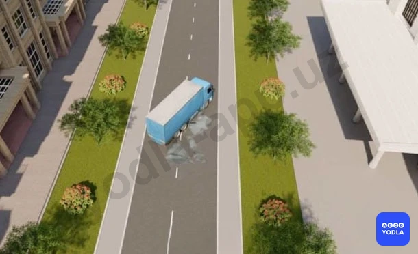
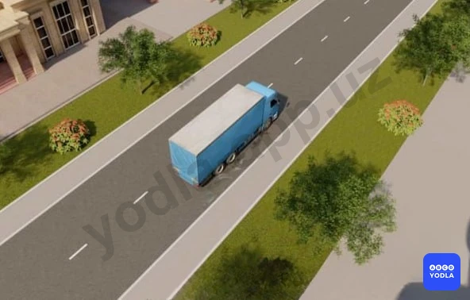
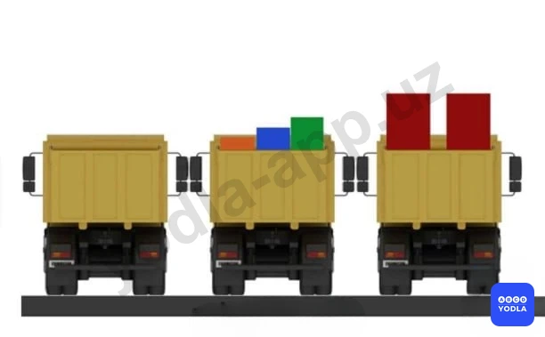
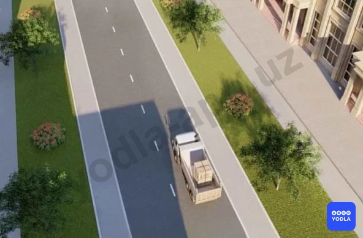
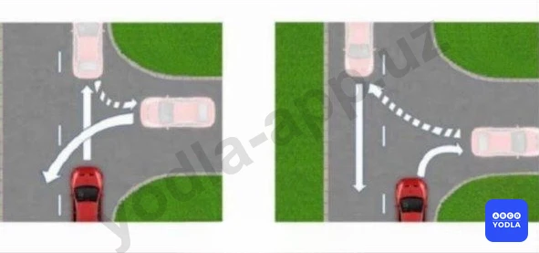

# 41. Основы безопасности движения (боб 30)

Всего вопросов: 69

## Вопрос 1

**При движении по кривой дороге автомобиль более устойчив; если движение осуществляется:**

✅ A. С включенной передачей
⬜ B. С выключенной передачей
⬜ C. С увеличением скорости

> 💡 При движении автомобиля на повороте возникает центробежная сила. Если поворот направо, существует вероятность выезда на полосу встречного движения; если налево — на обочину или за пределы дороги. При отключённой передаче автомобиль продолжает движение самостоятельно, и управление становится сложнее. Поэтому, приближаясь к повороту, оцените его крутизну и свою скорость, и продолжайте движение, не отключая механизм передачи.

---

## Вопрос 2

**Какие колеса автомобиля более подвержены торможению «со скольжением»?**

✅ A. Задние колеса
⬜ B. Передние колеса

> 💡 Под воздействием инерционной силы при торможении происходит перераспределение веса на оси. Вес увеличивается на переднюю ось и уменьшается на заднюю. Чем выше скорость торможения, тем более заметно перераспределение нагрузки на оси. С уменьшением нагрузки на заднюю ось уменьшается сцепление колеса с дорогой, что может привести к скольжению (движению без вращения колеса) и заносу автомобиля. Увеличение нагрузки на переднюю ось повышает сцепление колеса с дорогой, что снижает вероятность скольжения.

---

## Вопрос 3

**Вы остановились на подъеме в ожидании разрешающего сигнала светофора. При этом удерживать автомобиль на месте , лучше всего:**

✅ A. Стояночным тормозом
⬜ B. За счет пробуксовки сцепления при включенной первой передаче
⬜ C. Выключенным двигателем, с включенной пониженной передачей
⬜ D. Рабочим тормозом

> 💡 Рабочий (основной) тормоз предназначен для постоянного использования во время движения автомобиля и служит водителю для замедления или остановки движения автомобиля с различной интенсивностью. Стояночный тормоз предназначен для предотвращения скатывания автомобиля при длительной стоянке или стоянке.
На подъеме в ожидании разрешающего сигнала светофора удерживать автомобиль на месте лучше всего стояночным тормозом ("ручником"), т.к. это минимизирует риск того, что автомобиль скатится вниз.

---

## Вопрос 4

**Если сила тяги на колесах будет превышать силу сцепления колес с дорогой, то:**

⬜ A. Двигатель заглохнет
⬜ B. Увеличится износ деталей сцепления
✅ C. Ведущие колеса будут пробуксовывать

> 💡 При трогании с места возникает большая сила инерции, и для её преодоления необходимо приложить значительную тяговую силу к ведущим колесам. Во время равномерного движения по горизонтальной дороге с небольшой скоростью сила сопротивления невелика, и для её преодоления требуется меньшая тяговая сила. При избыточной тяге управляемые колёса могут пробуксовывать.

---

## Вопрос 5

**Какая из показанных автоцистерн более устойчива при повороте?**

⬜ A. Наполненная жидкостью на 75%
✅ B. Наполненная жидкостью полностью

> 💡 Потере устойчивости грузового автомобиля может способствовать незакрепленный груз. При движении на повороте незакрепленный груз может перемещаться по грузовой платформе и, ударяя в ее борт, приводить к опрокидыванию автомобиля. Аналогичные явления происходят при движении автомобильной цистерны с текучим грузом. При движении автомобиля с жидким грузом происходят перемещения груза от одного борта к другому. Раскачиваясь и ударяя в борта, жидкий груз также может вызвать потерю устойчивости автомобиля.

---

## Вопрос 6

**При возникновении заноса в результате торможения водитель должен:**

✅ A. Прекратить начатое торможение
⬜ B. Выключить сцепление
⬜ C. До предела нажать тормозную педаль
⬜ D. Выключить сцепление и тормозить стояночным тормозом

> 💡 Занос на скользкой дороге может возникнуть при торможении из-за блокировки задних колес автомобиля. В этом случае необходимо в первую очередь устранить причину заноса, то есть прекратить начатое торможение. В дальнейшем поворотом рулевого колеса в сторону заноса можно выровнять траекторию движения автомобиля.

---

## Вопрос 7

**Чем может быть вызвано боковое скольжение автомо­биля?**

⬜ A. Только резким поворотом
⬜ B. Только резким торможением
⬜ C. Резким разгоном и резким торможением
✅ D. Во всех перечисленных случаях

> 💡 Боковое скольжение автомобиля может быть вызвано резким поворотом, торможением или разгоном.

---

## Вопрос 8

**Что должен делать водитель автомобиля для прекращения начавшегося заноса задней оси заднеприводного автомобиля?**

⬜ A. Повернуть рулевое колесо в сторону;
✅ B. Повернуть рулевое колесо в сторону начавшегося заноса.
⬜ C. Нажать на педаль тормоза

> 💡 Занос на скользкой дороге может возникнуть из-за резкого поворота рулевого колеса. В этом случае необходимо быстро, но плавно повернуть рулевое колесо в сторону заноса и, не дожидаясь прекращения скольжения, опережающим воздействием на рулевое колесо выровнять траекторию движения автомобиля.

---

## Вопрос 9

**Какой прием торможения обеспечивает безопасную остановку заднеприводного автомобиля на скользкой дороге?**

⬜ A. Резкое нажатие на педаль тормоза без выключение сцепления
✅ B. Прерывистое торможение без выключения сцепления
⬜ C. Tорможение с выключенным сцеплением

> 💡 На скользкой дороге следует тормозить прерывистым нажатием на педаль тормоза, не выключая сцепление и передачу, используя торможение двигателем и не допуская блокировки (движение «юзом») колес.

---

## Вопрос 10

**В каком случае устойчивость автомобиля против опрокидывания повышается?**

⬜ A. Центр тяжести смешен вправо
⬜ B. Центр тяжести расположен высоко
✅ C. Центр тяжести расположен низко

> 💡 Автомобиль без груза и пассажиров более устойчив на повороте, так как у такого автомобиля самое низкое расположение центра тяжести, а значит, самый маленький опрокидывающий момент.

---

## Вопрос 11

**Как остановить автомобиль в случае внезапного отказа рабочего тормоза?**

✅ A. Перейти на низшую передачу; затормозить стояночным тормозом. При необходимости воспользоваться каким-либо препятствием
⬜ B. Выключить сцепление и резко тормозить стояночным тормозом

> 💡 Ситуация с внезапным отказом рабочего тормоза может иметь множество оттенков: скорость автомобиля, работоспособность стояночного тормоза, плотность потока, ширина дороги, пешеходы, зеленые насаждения, плотность застройки, встречные транспортные средства и многое-многое другое. Также много может быть принято решений. Отсюда понятно, что на вопрос «Что делать, когда отказали тормоза?» нельзя дать один ответ, приемлемый во всех случаях. Итак, в опасной ситуации самое главное: сохранять спокойствие и уверенность в себе; уметь быстро дать оценку сложившейся ситуации; принять такое решение, которое не причинит вреда и не подвергнет риску жизнь людей; выполняя принятое решение, быть всегда готовым к изменению своей тактики, так как ситуация может измениться.

---

## Вопрос 12

**Чем может быть вызвано интенсивное перемещение вперед пассажиров и неукрепленного груза?**

⬜ A. Только резким разгоном
✅ B. Только резким торможением
⬜ C. Резким разгоном и резким торможением

> 💡 Водитель, пассажиры, а также незакрепленный груз при резком торможении или столкновении, после мгновенной остановки автомобиля еще продолжают двигаться, сохраняя скорость движения, которую автомобиль имел перед остановкой. Именно в это время происходит большая часть травм в результате удара головой о ветровое стекло, грудью о рулевое колесо и рулевую колонку, коленями о нижнюю кромку щитка приборов. Из-за смещения груза автомобиль может потерять устойчивость и опрокинуться. Поэтому перед началом движения водителю и пассажирам необходимо пристегнуться ремнями безопасности и целесообразно закрепить груз.

---

## Вопрос 13

**Какие опасные последствия может вызвать резкое открытие дроссельной заслонки на скользкой дороге?**

⬜ A. Выход из строя деталей карбюратора
⬜ B. Прекращение работы двигателя
✅ C. Боковой занос автомобиля

> 💡 Открытие дроссельной заслонки карбюратора происходит при нажатии на педаль газа. При резком открытии дроссельной заслонки на скользкой дороге произойдет пробуксовка ведущих колес и возможен боковой занос автомобиля. Вряд ли карбюратор сломается при резком нажатии на педаль газа. Двигатель не прекращает работу при нажатии на педаль газа, а наоборот, начинает интенсивнее работать.

---

## Вопрос 14

**Какой из указанных автомобилей наиболее устойчив против опрокидывания?**

⬜ A. Автобус при наличии в нем стоящих пассажиров
⬜ B. Автокран
✅ C. Порожний грузовой автомобиль

> 💡 Более устойчив на повороте автомобиль без груза и пассажиров, так как у такого автомобиля самое низкое расположение центра тяжести, а значит, самый маленький опрокидывающий момент.

---

## Вопрос 15

**Как влияет торможение "юзом' на тормозной путь при сухом состоянии дороги?**

⬜ A. Тормозной путь уменьшается
⬜ B. Тормозной путь не изменяется
✅ C. Тормозной путь увеличивается

> 💡 Уменьшение тормозного пути достигается торможением на грани блокировки, так как заблокированные колеса (торможение «юзом») скользят по дороге, увеличивая при этом тормозной путь.

---

## Вопрос 16

**Какие колеса автомобиля более склонны к затормаживанию на "юз"?**

✅ A. Задние колеса
⬜ B. Передние колеса

> 💡 Под воздействием инерционной силы при торможении происходит перераспределение веса на оси. Вес увеличивается на переднюю ось и уменьшается на заднюю. Чем выше скорость торможения, тем более заметно перераспределение нагрузки на оси. С уменьшением нагрузки на заднюю ось уменьшается сцепление колеса с дорогой, что может привести к скольжению (движению без вращения колеса) и заносу автомобиля. Увеличение нагрузки на переднюю ось повышает сцепление колеса с дорогой, что снижает вероятность скольжения.

---

## Вопрос 17

**В каком случае центробежная сила при повороте уменьшается?**

⬜ A. При резком повороте рулевого колеса в сторону поворота
✅ B. При снижении скорости движения
⬜ C. При уменьшении радиуса поворота

> 💡 При прохождении поворота водителю следует учитывать, что при увеличении скорости движения автомобиля центробежная сила увеличивается пропорционально квадрату скорости, что может привести к опрокидыванию транспортного средства.

---

## Вопрос 18

**Смещается ли прицеп автопоезда при движении на повороте?**

⬜ A. Смещается в сторону от центра поворота
⬜ B. Не смещается
✅ C. Смещается к центру поворота

> 💡 При одновременном прохождении поворота с автопоездом вам следует позаботиться об увеличении бокового интервала до этого транспортного средства, так как задние колеса автопоезда (прицепа) смещаются к центру поворота и увеличивается коридор движения автопоезда

---

## Вопрос 19

**На сухой дороге для экстренной остановки необходимо:**

⬜ A. Выключить сцепление и сразу нажать на педаль тормоза
⬜ B. Выключить передачу (поменять скорость) и резко нажать на педаль тормоза
✅ C. Нажать на педаль тормоза; не выключая сцепление

> 💡 Экстренным называется торможение высокой интенсивности для предотвращения наезда на, неожиданно появившееся или поздно замеченное, препятствие. Поэтому, рассчитывая на возможность внезапного появления, например ребенка на дороге, водитель точно должен знать, как вести себя при экстренном торможении. Существуют следующие правила: тверже держите рулевое колесо двумя руками; не блокируйте колеса автомобиля, так как продольный юз колес не уменьшает тормозной путь; не выжимайте педаль сцепления; не применяйте на ходу стояночный тормоз, ибо это может усилить юз задних колес. Надо нажимать на педаль тормоза сильно (не резко), но плавно, с нарастанием по мере зацепления шин за дорогу. Даже при экстренном торможении не теряйте контроль над автомобилем.

---

## Вопрос 20

**Что должен учитывать водитель при определении наибольшей ширины полосы движения автопоезда?**

⬜ A. Только габариты автопоезда по ширине
✅ B. Габариты транспортного средства по ширине, а также влияние прицепа и смещение его к центру поворота

> 💡 Все приемы вождения одиночного автомобиля применимы для автопоезда, однако ввиду его значительного веса и габаритов имеются и особенности. Автопоезд представляет собой автомобиль- тягач с одним полуприцепом или с одним или несколькими прицепами. Во время движения прицеп постоянно отклоняется в стороны от траектории движения автомобиля-тягача, что повышает опасность при обгоне и встречном разъезде. Маневренность автопоезда хуже, чем у одиночного автомобиля. Водителю следует учитывать, что во время поворота автопоезда прицеп смещается в сторону центра поворота и увеличивается коридор движения автопоезда.

---

## Вопрос 21

**Какие правила торможения автопоезда должен соблюдать водитель?**

⬜ A. Тормозить резким порывистым нажатием на педаль тормоза, выключив при этом сцепление
✅ B. Тормозить плавно, заблаговременно снизить скорость, не выключая сцепление

> 💡 При подсоединении прицепа, не имеющего своей тормозной системы, тормозной путь автомобиля увеличивается, так как увеличивается масса сцепленных транспортных средств. Останавливать автопоезд можно только на прямых участках, так, чтобы весь он располагался на одной линии. При торможении на закруглении может возникнуть занос прицепа или складывание автопоезда, за которым может последовать опрокидывание, сталкивание автомобиля- тягача в кювет или поломка буксирного устройства.

---

## Вопрос 22

**Чем опасно резкое открытие дроссельной заслонки карбюратора при движении на скользкой дороге?**

⬜ A. Двигатель заглохнет
⬜ B. Значительно возрастет расход топлива
✅ C. Может возникнуть боковой занос автомобиля
⬜ D. Двигатель превысит максимальную частоту вращения коленчатого вала

> 💡 ПДД общие положения: «Пассажир» - это лицо, находящееся в транспортном средстве, а также лицо, которое входит в транспортное средство или выходит из транспортного средства.

---

## Вопрос 23

**Как пользоваться тормозами на скользкой дороге?**

✅ A. Плавно тормозить не выключая сцепления и не производить резких поворотов рулевым колесом
⬜ B. Выключить сцепление и плавно тормозить
⬜ C. Тормозить резким прерывистым нажатием на педаль тормоза

> 💡 На скользкой дороге следует тормозить прерывистым нажатием на педаль тормоза, не выключая сцепление и передачу, используя торможение двигателем и не допуская блокировки (движение «юзом») колес.

---

## Вопрос 24

**После преодоления глубокого брода водитель обязан:**

⬜ A. Двигаться с ускорением на более высоких передачах
✅ B. На короткой дистанции пробега несколькими резкими нажатиями на тормозную педаль просушить тормозные накладки

> 💡 После проезда водной преграды необходимо просушить тормозные колодки. Просушить тормозные колодки многократными непродолжительными нажатиями на педаль тормоза позволит быстро восстановить эффективность тормозов всех колес автомобиля.

---

## Вопрос 25

**Как следует выезжать из глубокой колеи в зимнее время на заднеприводном автомобиле?**

✅ A. Выезжать на небольшой скорости, в первоначальный момент энергично повернуть рулевое колесо в противоположную сторону выезда, а затем в сторону выезда
⬜ B. Начать выезжать из колеи как можно быстрее, сначала повернуть рулевое колесо в сторону выезда, а затем в противоположную

> 💡 Выезжать из глубокой колеи в зимнее время на заднеприводном автомобиле нужно на небольшой скорости, в первоначальный момент энергично повернуть рулевое колесо в противоположную сторону выезда, а затем в сторону выезда. Если сначала повернуть руль в сторону выезда, а затем в противоположную, то в итоге автомобиль поедет в противоположную от выезда сторону.

---

## Вопрос 26

**Применение торможения двигателем на скользкой дороге для заднеприводного автомобиля:**

✅ A. Повышает устойчивость автомобиля
⬜ B. Снижает устойчивость автомобиля
⬜ C. Не оказывает какого-либо влияния на устойчивость автомобиля

> 💡 На скользкой дороге следует тормозить прерывистым нажатием на педаль тормоза, не выключая сцепление и передачу, используя торможение двигателем и не допуская блокировки колес (движение «юзом»).

---

## Вопрос 27

**При каких из перечисленных условиях запрещается эксплуатация автомобилей и автопоездов?**

✅ A. Нарушена герметичность гидравлического тормозного привода
⬜ B. Рычаг стояночной тормозной системы удерживается запирающим устройством
⬜ C. Стояночная тормозная система обеспечивает неподвижное состояние транспортных средств с полной нагрузкой на уклоне не менее 16%

> 💡 В “Условиях, при которых запрещается эксплуатация транспортных средств” (приложение №3 к ПДД) сказано, что эксплуатация транспортных средств запрещена, если: 1.3. Нарушена герметичность гидравлического тормозного привода.

---

## Вопрос 28

**Что должен сделать водитель, если неожиданно лопнула шина?**

⬜ A. Тормозить рабочим тормозом до полной остановки машины
⬜ B. Остановить машину с помощью стояночного тормоза
✅ C. Держать руль, сохранить движение по прямой, снизить скорость и остановить машину

> 💡 Если неожиданно лопнула шина, машину может занести, поэтому необходимо удерживать руль так, чтобы сохранить движение по прямой, снизить скорость и остановиться.

---

## Вопрос 29

**Какие опасные последствия могут возникнуть при торможении автомобиля с различным износом шин правых и левых колес?**

⬜ A. Перегрев тормозных барабанов
⬜ B. Отслоение протектора
✅ C. Занос с возможным опрокидыванием автомобиля

> 💡 Шины, установленные на одной оси (правая и левая) во всех случаях должны иметь одинаковый рисунок протектора и одинаковую изношенность, так как это является одним из условий обеспечения устойчивости автомобиля при торможении. При отклонении от этих норм в процессе торможения возникают разные тормозные силы, которые создают дестабилизирующий момент, приводящий к потере устойчивости. Та сторона автомобиля, на которой расположена шина с изношенным рисунком протектора, забегает вперед, противоположная сторона отстает. При этом автомобиль смещается в сторону и при неблагоприятных условиях может потерять устойчивость и опрокинуться.

---

## Вопрос 30

**Для предотвращения опасный последствий заноса автомобиля водитель должен:**

⬜ A. Резко нажать на педаль тормоза
⬜ B. Нажать на педаль сцепления
✅ C. Прекратить начатое торможение

> 💡 Занос на скользкой дороге может возникнуть при торможении из-за блокировки задних колес автомобиля. В этом случае необходимо в первую очередь устранить причину заноса, то есть прекратить начатое торможение. В дальнейшем поворотом рулевого колеса в сторону заноса можно выровнять траекторию движения автомобиля.

---

## Вопрос 31

**В каких случаях увеличивается центробежная сила автомобиля на поворотах?**

⬜ A. С увеличением радиуса поворота
✅ B. С увеличением скорости движения
⬜ C. С уменьшением скорости движения

> 💡 Центробежная сила автомобиля на поворотах увеличивается с увеличением скорости движения. С увеличением радиуса поворота или уменьшением скорости движения центробежная сила на поворотах уменьшается.

---

## Вопрос 32

**Как влияет изношенный протектор шин на коэффициент сцепления?**

⬜ A. Коэффициент сцепления повышается
⬜ B. Коэффициент сцепления не изменяется
✅ C. Коэффициент сцепления снижается

> 💡 По мере износа протектора ухудшается сцепление колеса с дорогой и увеличивается вероятность заноса при торможении или разгоне. Коэффициент сцепления шины, протектор которой изношен до полного исчезновения рисунка, почти вдвое меньше коэффициента сцепления новой шины. Поэтому эксплуатация автомобиля с изношенными шинами недопустима и запрещена Правилами дорожного движения.

---

## Вопрос 33

**В чем опасность длительного торможения автомобиля с выключенной передачей на крутых затяжных спусках?**

⬜ A. Повышенный износ шин
⬜ B. Повышенный износ деталей сцепления
✅ C. Перегрев тормозов и отказ их в работе

> 💡 Опасность длительного торможения с выключенным сцеплением на крутом спуске заключается в перегреве тормозных механизмов и уменьшении эффективности торможения.

---

## Вопрос 34

**Разрешается ли пользоваться накатом при движении на крутых спусках горных дорог?**

⬜ A. Рекомендуется, если автомобиль оборудован гидровакуумным усилителем тормозов
⬜ B. Рекомендуется, если дорога в хорошем состоянии и просматривается на далекое расстояние
✅ C. Запрещается

> 💡 Согласно пункту 130 главы 21 ПДД, на участках дорог, обозначенных дорожным знаком 1.13, запрещается движение с выключенными передачей и сцеплением.

---

## Вопрос 35

**Что следует предпринять водителю для предотвращения опасных последствий заноса автомобиля при резком повороте рулевого колеса на скользкой дороге?**

✅ A. Быстро, но плавно повернуть рулевое колесо в сторону заноса, затем опережающим воздействием на рулевое колесо выровнять траекторию движения автомобиля
⬜ B. Выключить сцепление
⬜ C. Нажать на педаль тормоза

> 💡 Согласно пункту 88 Правил дорожного движения, остановка и стоянка транспортных средств разрешается как можно правее на обочине, а при ее отсутствии — у края проезжей части, и в случаях, указанных в пункте 89 настоящих Правил — на тротуаре.
Согласно абзац третий пункта 89 Правил дорожного движения, стоянка на краю тротуара, граничащего с проезжей частью, разрешается только легковым автомобилям, мотоциклам, мопедам и велосипедам в местах, обозначенных дорожным знаком 5.15, установленным вместе с одним из дорожных знаков 7.6.2, 7.6.3, 7.6.6 — 7.6.9.
Согласно пункту 91 Правил дорожного движения, остановка запрещается в следующих местах: в местах, где расстояние между сплошной линией дорожной разметки (кроме обозначающей край проезжей части), разделительной полосой или противоположным краем проезжей части и остановившимся транспортным средством менее 3 м.

---

## Вопрос 36

**Как правильно произвести экстренное торможение, если автомобиль оборудован ABS антиблокировочной тормозной системой?**

⬜ A. Путем прерывистого нажатия на педаль тормоза
✅ B. Путем нажатия на педаль тормоза до упора и удерживания ее до полной остановки
⬜ C. Путем использования стояночной тормозной системы

> 💡 Согласно знаку 5.35 раздела 5 приложения № 1 к ПДД, «Реверсивное движение», начало участка дороги, на котором на одной или нескольких полосах направление движения может измениться на противоположное.

---

## Вопрос 37

**В каком случае легковой автомобиль более устойчив против опрокидывания на повороте?**

✅ A. Без груза и пассажиров
⬜ B. С пассажирами, но без груза
⬜ C. Без пассажиров, но с грузом на верхнем багажнике

> 💡 Согласно термину 11 пункта 6 главы 1 ПДД, вынужденная остановка – прекращение движения транспортного средства по причине технической неисправности или опасности, создаваемой перевозимым грузом, состоянием водителя, пассажира, препятствием на дороге или метеорологическими условиями. Такое поведение водителя является крайне необходимой мерой и не признается правонарушением.

---

## Вопрос 38

**Как влияет длительный разгон транспортного средства с включенной первой передачей на расход топлива?**

✅ A. Расход топлива увеличивается
⬜ B. Расход топлива уменьшается
⬜ C. Расход топлива не изменяется

> 💡 Согласно требованиям безопасности дорожного движения, длительный разгон на первой передаче приводит к увеличению расхода топлива.

---

## Вопрос 39

**Что следует сделать водителю, чтобы предотвратить возникновение заноса при проезде крутого поворота?**

⬜ A. Перед поворотом снизить скорость и выжать педаль сцепления, чтобы дать возможность автомобилю двигаться накатом на повороте
✅ B. .Перед поворотом снизить скорость, при необходимости включить пониженную передачу, а при проезде поворота не увеличивать резко скорость и не тормозить.
⬜ C. Допускается любое из перечисленных действий

> 💡 Согласно пункту 6 Правил дорожного движения, недостаточная видимость — видимость дороги менее 300 м в условиях дождя, снегопада, тумана и в других подобных условиях, а также в сумерки.
Согласно пункту 137 Правил дорожного движения, противотуманные фары могут использоваться в следующих случаях: в условиях недостаточной видимости самостоятельно, а также с ближним или дальним светом фар.

---

## Вопрос 40

**Как изменяется длина тормозного пути легкового автомобиля при движении с прицепом, не имеющим тормозной системы?**

⬜ A. Тормозной путь уменьшается, так как прицеп оказывает дополнительное сопротивление движению
✅ B. Тормозной путь увеличивается
⬜ C. Тормозной путь не изменяется

---

## Вопрос 41

**В тёмное время суток и в пасмурную погоду скорость встречного автомобиля воспринимается?**

✅ A. Ниже, чем в действительности
⬜ B. Выше, чем в действительности
⬜ C. Восприятие скорости не меняется

> 💡 Согласно требованиям безопасности дорожного движения, водитель должен всегда учитывать ситуацию сзади, в том числе при резком торможении, а также при торможении на мокром покрытии или скользкой дороге.

---

## Вопрос 42

**В каком из перечисленных случаев водителю следует оценивать обстановку сзади?**

⬜ A. Только при резком торможении
⬜ B. Только при торможении на дороге с мокрым или скользким покрытием
✅ C. При любом торможении

> 💡 Занос автомобиля при проезде крутого поворота возникает под действием центробежной силы, которая возрастает с увеличением скорости движения. Поэтому для предотвращения возможного заноса водитель должен с учетом крутизны поворота заблаговременно снизить скорость, при необходимости включить пониженную передачу и проехать поворот, не прибегая к резкому увеличению скорости и торможению. Прохождение поворота с выключенным сцеплением может привести к потере контроля над управлением автомобилем.

---

## Вопрос 43

**Исключает ли антиблокировочная тормозная система (АБС) возможность возникновения заноса или сноса при прохождении поворота?**

⬜ A. Полностью исключает возможность возникновения только заноса
⬜ B. Полностью исключает возможность возникновения только сноса
✅ C. Не исключает возможность возникновения сноса или заноса

> 💡 При трогании на подъеме стояночный тормоз следует начинать отпускать одновременно с началом движения, чтобы избежать скатывания автомобиля (при отпускании до начала движения) и остановки двигателя (при отпускании после начала движения).

---

## Вопрос 44

**В какой момент следует начинать отпускать стояночный тормоз при трогании на подъеме?**

⬜ A. До начала движения
⬜ B. После начала движения
✅ C. Одновременно с началом движения

> 💡 Согласно пункту 91 Правил дорожного движения, остановка запрещается в следующих местах: на пересечении проезжих частей и ближе 30 м от края пересекаемой проезжей части, за исключением стороны напротив бокового проезда трехсторонних пересечений (перекрестков), имеющих сплошную линию дорожной разметки или разделительную полосу.

---

## Вопрос 45

**Как воспринимается водителем скорость своего автомобиля при длительном движении по ровной-широкой дороге на большой скорости?**

✅ A. Кажется меньше чем в действительности
⬜ B. Кажется больше, чем в действительности
⬜ C. Восприятие скорости не меняется

> 💡 Согласно пункту 66 Правил дорожного движения, на дорогах с двусторонним движением, имеющих три полосы, обозначенные разметкой (за исключением дорожной разметки 1.9), из которых средняя используется для движения в обоих направлениях, разрешается выезжать на эту полосу только для обгона, объезда, поворота налево или разворота. Выезжать на крайнюю левую полосу, предназначенную для встречного движения, запрещается.

---

## Вопрос 46

**При движении по какому участку дороги действие сильного бокового ветра наиболее опасно?**

⬜ A. По открытому
⬜ B. По закрытому деревьями
✅ C. При выезде с закрытого участка на открытый

> 💡 Согласно пункту 63 Правил дорожного движения, при движении транспортного средства задним ходом водитель должен обеспечить безопасность движения и не создавать помех другим участникам движения. При необходимости водитель должен прибегнуть к помощи других лиц.

---

## Вопрос 47

**Как водитель должен воздействовать на педаль управления подачей топлива при возникновении заноса, вызванного резким ускорением движения?**

⬜ A. Усилить нажатие на педаль
⬜ B. Не менять силу нажатия на педаль
✅ C. Уменьшить нажатие на педаль

> 💡 Занос на скользкой дороге может возникнуть при резком ускорении движения из-за пробуксовки ведущих колес автомобиля. В этом случае необходимо устранить причину заноса, т.е. ослабить нажатие на педаль управления подачей топлива.

---

## Вопрос 48

**Как следует поступить водителю, если во время движения по сухой дороге с асфальтобетонным покрытием начал капать дождь?**

✅ A. Уменьшить скорость и быть особенно осторожным
⬜ B. Не изменяя скорости, продолжить движение
⬜ C. Увеличить скорость и попытаться проехать как можно большее расстояние, пока не начался сильный дождь

> 💡 Знак 4.1.1 раздела 4 приложения № 1 к ПДД, «Движение прямо». Разрешается движение только в направлениях, указанных на знаках стрелками.
Знак 7.4.1 раздела 7 приложения № 1 к ПДД, «Вид транспортного средства». Указывают вид транспортного средства, на который распространяется действие знака. Дорожный знак 7.4.1 распространяет действие знака на грузовые автомобили, в том числе и с прицепом, с разрешенной максимальной массой более 3,5 т.
Легковому автомобилю разрешено движение в любом направлении.

---

## Вопрос 49

**Какое управление автомобилем экономит расход топлива?**

⬜ A. При быстром ускорении и мягком (плавном) торможении
⬜ B. При плавном ускорении и быстром торможении
✅ C. При плавном ускорении и плавном торможении

> 💡 Согласно пункту 100 Правил дорожного движения, При движении в направлении зеленой стрелки, включённой в дополнительной секции одновременно с жёлтым или красным сигналом светофора, водитель транспортного средства обязан уступить дорогу транспортным средствам, движущимся с других направлений.

---

## Вопрос 50

**Для предупреждения скатывания автомобиля с механической трансмиссией при кратковременной остановке на подъёме следует:**

✅ A. Должен использоваться стояночный тормоз.
⬜ B. Необходимо подключить первую передачу или заднюю передачу
⬜ C. Необходимо перевести рычаг коробки передач в нейтральное положение.

> 💡 Согласно пункту 1.6 Приложение № 3 к Правилам дорожного движения, стояночная тормозная система не обеспечивает неподвижное состояние:
автотранспортных средств категорий N не менее 31%.

---

## Вопрос 51

**При потере сцепления колёс с дорогой (сильный дождь или затопление участка дороги) водитель:**

⬜ A. Должен увеличить скорость.
⬜ B. Он должен снизить скорость, резко нажав на педаль тормоза.
✅ C. Необходимо снизить скорость и применить торможение двигателем.

> 💡 Согласно статьи 6 Правил дорожного движения, пешеходная дорожка — поверхность отдельной дороги или искусственного сооружения, построенная или приспособленная для движения пешеходов, отмеченная соответствующим дорожным знаком. Часть, где запрещено движение транспортных средств.

---

## Вопрос 52

**Какой способ управления автомобилем экономит расход топлива?**

⬜ A. С быстрым ускорением и плавным торможением
⬜ B. С плавным ускорением и быстрым торможением
✅ C. С плавным ускорением и плавным торможением

> 💡 Согласно пункту 61 Правил дорожного движения, при наличии полосы торможения водитель, намеревающийся повернуть, должен своевременно перестроиться на эту полосу и снижать скорость только на ней.

---

## Вопрос 53

**Какова траектория движения прицепа при повороте автомобиля к центру поворота?**

⬜ A. Смещается в сторону от центра поворота.
⬜ B. Не смещается
✅ C. Смещается к центру поворота

> 💡 Пункта 107 главы 16 ПДД, гласит: При повороте налево или развороте водитель безрельсового транспортного средства обязан уступить дорогу транспортным средствам, движущимся по равнозначной дороге со встречного направления прямо или направо, а также производящим обгон в разрешенных случаях. Этим же правилом должны руководствоваться между собой водители трамваев.

---

## Вопрос 54

**В случае потери сцепления колёс с дорогой из-за образования «водяного клина» водителю следует:**

⬜ A. Увеличить скорость
⬜ B. Он должен снизить скорость, резко нажав на педаль тормоза
✅ C. Он должен снизить скорость, затормозив двигателем

> 💡 Согласно статьи 6 Правил дорожного движения, приоритет — право на первоочередное движение в намеченном направлении по отношению к другим участникам движения.

---

## Вопрос 55

**Что называют тормозным путем?**

⬜ A. Расстояние, пройденное транспортным средством до полной остановки автомобиля после обнаружения опасности.
✅ B. Расстояние, пройденное транспортным средством с момента нажатия на педаль тормоза до полной остановки

> 💡 Тормозным путем автомобиля называется путь, пройденный автомобилем с момента нажатия на педаль тормоза, до его полной остановки.

---

## Вопрос 56

**Как изменяется поле зрение водителя с увелечением скорости движения?**

⬜ A. Расширяется
⬜ B. Не изменяется
✅ C. Сужается

> 💡 Дорожные знаки разделены на 7 групп согласно приложению 1 Правил дорожного движения.

---

## Вопрос 57

**Среднее время реакции водителя составляет:**

⬜ A. Около 0,2 секунды.
✅ B. Около 1 секунды
⬜ C. Около 5 секунд

> 💡 Согласно предмету Первой помощи при дорожно-транспортных происшествиях, оказание первой при черепно-мозговой травме, сотрясении мозга или травме шеи осуществляется в следующем порядке: пострадавшего надо положить на твёрдые носилки, под область шеи подложить твёрдую подушку, не двигать, крепко связать и отправить в больницу.

---

## Вопрос 58

**На повороте возник занос оси переднеприводного автомобиля Ваши действия?**

⬜ A. Уменьшаете подачу топлива, рулевым колесом стабилизируете движение.
⬜ B. Притормаживаете и руль поворачиваете в сторону заноса.
✅ C. Слегка увеличиваете подачу топлива, корректируя направление движения рулевым колесом.
⬜ D. Значительно увеличиваете подачу топлива не меняя положения рулевого колеса

> 💡 Согласно пункту 63 главы 9 ПДД, движение задним ходом на перекрестках запрещается.

---

## Вопрос 59

**В случае, когда правые колёса автомобиля наезжают на неукреплённую влажную обочину, рекомендуется?**

⬜ A. Торможение и полная остановка транспортного средства
⬜ B. Затормозить автомобиль и плавно вывернуть на проезжую часть дороги
✅ C. Плавно направить автомобиль без торможения на проезжую часть дороги

> 💡 Согласно пункту 78 главы 11 ПДД: В населенных пунктах разрешается движение транспортных средств со скоростью не более 70 км/ч, не более 30 км/ч (при установке соответствующих дорожных знаков) на расстоянии не менее 300 метров перед школами и дошкольными учреждениями и проехав их, а в жилых зонах и прилегающих территориях (участок земли между домовыми постройками) не более 20 км/ч.

---

## Вопрос 60

**При торможении двигателем иа крутых спусках какая передача выбирается в зависимости от уклона?**

⬜ A. Чем круче уклон, тем выше выбирается передача
✅ B. Чем круче уклон, тем ниже выбирается передача
⬜ C. Выбор передачи не зависит от крутизны спуска

> 💡 Согласно пункту 137 Правил дорожного движения, противотуманные фары могут использоваться в следующих случаях: в темное время суток на неосвещенных участках дорог совместно с ближним или дальним светом фар.

---

## Вопрос 61

**В случае, когда правые колёса автомобиля наезжают на мокрую, влажную обочину, рекомендуется:**

⬜ A. Торможение и полная остановка транспортного средства
⬜ B. Торможение автомобиля и плавный поворот на проезжую часть дороги.
✅ C. Мягко и плавно поворачивайте автомобиль на проезжую часть дороги без торможения

> 💡 Согласно статьи 6 Правил дорожного движения, населенный пункт — территория, въезды и выезды которые обозначены дорожными знаками 5.22 — 5.25.

---

## Вопрос 62

**В случае, когда правые колёса автомобиля наезжают на неукреплённую влажную обочину, рекомендуется:**

⬜ A. Затормозить и полностью остановиться
⬜ B. Затормозить и плавно направить автомобиль на проезжую часть
✅ C. Не прибегая к торможению, плавно направить автомобиль на проезжую часть

> 💡 Согласно статьи 6 Правил дорожного движения, разделительная полоса — элемент дороги, разделяющий смежные проезжие части и не предназначенный для движения и остановки транспортных средств, приподнята над уровнем дороги или отделена газоном, канавой, специальными ограждениями.

---

## Вопрос 63

**На повороте возник занос оси переднеприводного автомобиля Ваши действия?**

⬜ A. Уменьшаете подачу топлива, рулевым колесом стабилизируете движение.
⬜ B. Притормаживаете и руль поворачиваете в сторону заноса
✅ C. Слегка увеличиваете подачу топлива, корректируя направление движения рулевым колесом.
⬜ D. Значительно увеличиваете подачу топлива не меняя положения рулевого колеса

> 💡 Согласно пункту 38 Правил дорожного движения, Сигналы регулировщика имеют следующие значения: правая рука вытянута вперед: со стороны левого бока — разрешено движение трамваю налево, безрельсовым транспортным средствам — во всех направлениях; со стороны груди — всем транспортным средствам разрешено движение только направо; со стороны правого бока и спины — движение всех транспортных средств запрещено; пешеходам разрешено переходить проезжую часть за спиной регулировщика.
Согласно пункту 101 Правил дорожного движения, если сигналы светофора или регулировщика разрешают движение одновременно трамваю и безрельсовым транспортным средствам, то трамвай имеет право на первоочередное движение, независимо от направления его движения.
В этой ситуации водитель автомобиля выпольняет разворот, уступив дорогу трамваю.

---

## Вопрос 64

**АБС автомобиля предотвращает ли его скольжение и боковой занос при повороте ?**

⬜ A. Только предотвращает занос автомобиля.
⬜ B. Только предотвращает возможность скольжения автомобиля в сторону.
✅ C. Не исключает боковое скольжение и скольжение автомобиля в сторону

> 💡 Согласно пункту 98 Правил дорожного движения, перекресток, где очередность движения определяется сигналами светофора или регулировщика, считается регулируемым. 
При желтом мигающем сигнале, неработающих светофорах или отсутствии регулировщика перекресток считается нерегулируемым, и водители обязаны руководствоваться правилами проезда нерегулируемых перекрёстков и установленными на перекрёстке знаками приоритета.

---

## Вопрос 65

**Более устойчив против опрокидывания на повороте легковой автомобиль:**

✅ A. Без пассажиров и груза
⬜ B. Без пассажиров, но с грузом на верхнем багажнике
⬜ C. С пассажирами, но без груза
⬜ D. С пассажирами и грузом

> 💡 Согласно пункту 73 Правил дорожного движения, водитель должен соблюдать такую дистанцию до движущегося впереди транспортного средства, которая гарантировала бы избежание столкновения в случае его экстренной остановки, а также боковой интервал, обеспечивающий безопасность дорожного движения.

---

## Вопрос 66

**В случае остановки на подъеме при наличии тротуара можно предотвратить самопроизвольное скатывание автомобиля, повернув его передние колеса в положение**

⬜ A. A и D
⬜ B. B и C
✅ C. A и C
⬜ D. B и D

> 💡 Согласно статьи 163 Правил дорожного движения,  Груз, выступающий за габариты транспортного средства спереди и сзади более чем на 1 м или сбоку более чем на 0,4 м от внешнего края габарита, должен быть обозначен опознавательными знаками «Крупногабаритный груз».

---

## Вопрос 67

**Способ разворота с использованием прилегающей территории справа, обеспечивающий безопасность движения, показан**

✅ A. Только на левом рисунке
⬜ B. Только на правом рисунке
⬜ C. На обоих рисунках

---

## Вопрос 68

**Двигаясь в прямом направлении, Вы внезапно попали на небольшой участок скользкой дороги. Что следует предпринять?**

⬜ A. Плавно затормозить
⬜ B. Повернуть руль, чтобы съехать с этого участка дороги
✅ C. Проехать не меняя траектории и скорости движения

> 💡 Согласно пункту 86 Правил дорожного движения, обгон запрещен: на железнодорожных переездах и ближе чем за 100 м перед ними.

---

## Вопрос 69

**Как изменяется длина тормозного пути легкового автомобиля при движении с прицепом, не имеющим тормозной системы?**

⬜ A. Уменьшается, так как прицеп оказывает дополнительное сопротивление движению
⬜ B. Не изменяется
✅ C. Увеличивается

> 💡 Вождение автомобиля с прицепом требует определенного навыка. Тормозной путь увеличивается.

---

