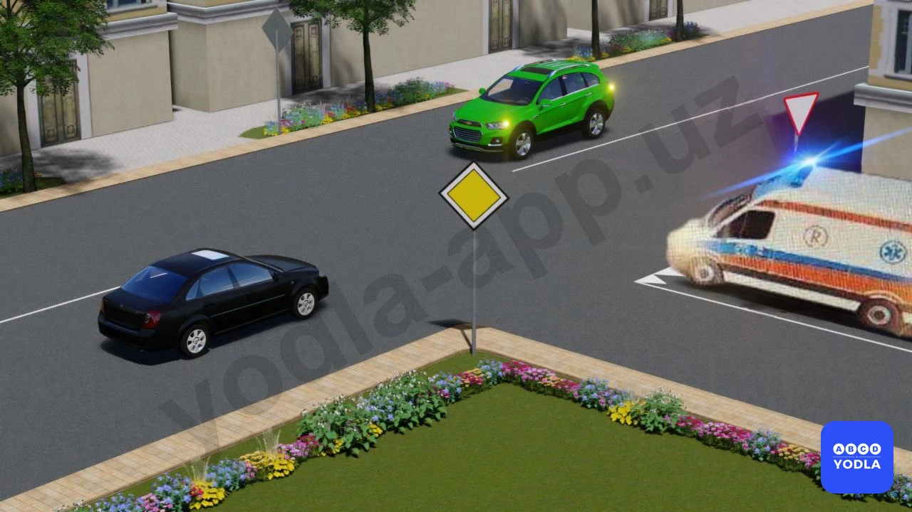
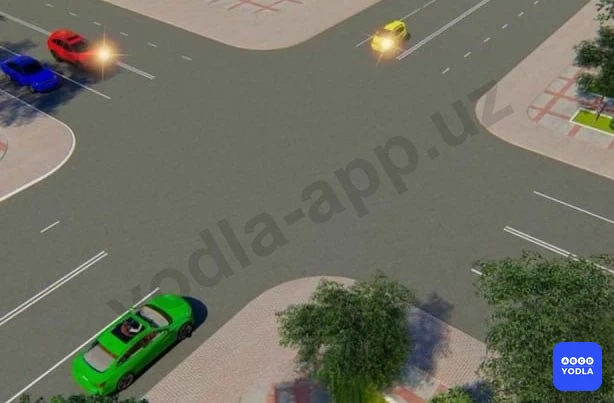

# Экзамен (OZ) — образец

Всего вопросов: 20

## Вопрос 1

****

⬜ A. 
✅ B. 
⬜ C. 

---

## Вопрос 2

****

✅ A. 
⬜ B. 
⬜ C. 

---

## Вопрос 3

****

⬜ A. 
✅ B. 
⬜ C. 
⬜ D. 

---

## Вопрос 4

****

⬜ A. 
⬜ B. 
✅ C. 

---

## Вопрос 5

****

✅ A. 
⬜ B. 
⬜ C. 

---

## Вопрос 6

****

⬜ A. 
⬜ B. 
⬜ C. 
✅ D. 

---

## Вопрос 7

****

⬜ A. 
⬜ B. 
⬜ C. 
⬜ D. 
✅ E. 

---

## Вопрос 8

****

✅ A. 
⬜ B. 

---

## Вопрос 9

****

⬜ A. 
✅ B. 
⬜ C. 

---

## Вопрос 10

****

⬜ A. 
⬜ B. 
✅ C. 

---

## Вопрос 11

****

⬜ A. 
✅ B. 
⬜ C. 
⬜ D. 

---

## Вопрос 12

****

✅ A. 
⬜ B. 
⬜ C. 

---

## Вопрос 13

****

⬜ A. 
✅ B. 
⬜ C. 

---

## Вопрос 14

****

⬜ A. 
⬜ B. 
✅ C. 
⬜ D. 
⬜ E. 

---

## Вопрос 15

****

⬜ A. 
⬜ B. 
✅ C. 

---

## Вопрос 16

****

⬜ A. 
⬜ B. 
✅ C. 

---

## Вопрос 17

****

⬜ A. 
⬜ B. 
⬜ C. 
✅ D. 

---

## Вопрос 18

****

⬜ A. 
⬜ B. 
⬜ C. 
✅ D. 

---

## Вопрос 19

****

⬜ A. 
⬜ B. 
✅ C. 

---

## Вопрос 20

****

⬜ A. 
✅ B. 
⬜ C. 

---

